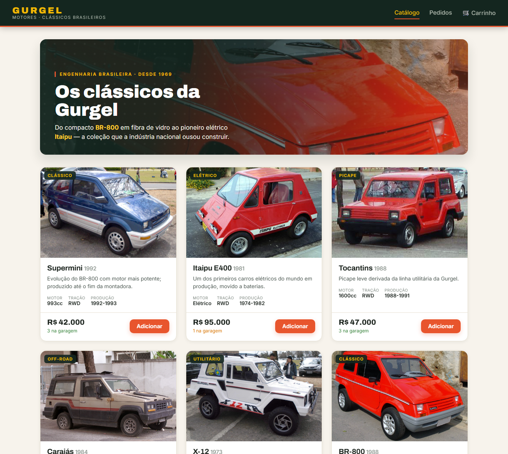
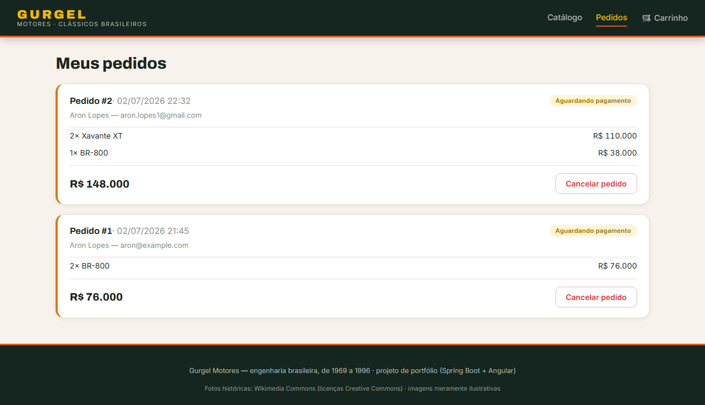

<div align="center">

# Gurgel E-commerce 🚗🇧🇷

**E-commerce full-stack dos carros clássicos da [Gurgel Motores](https://pt.wikipedia.org/wiki/Gurgel)** — a montadora brasileira que, entre **1969 e 1996**, ousou projetar do compacto BR-800 em fibra de vidro ao pioneiro elétrico Itaipu.

Projeto de portfólio: uma API REST em **Spring Boot 3** com arquitetura em camadas e princípios SOLID, e um SPA em **Angular 20** com design próprio inspirado no modernismo brasileiro.

[](https://github.com/AronBastos/gurgel-ecommerce/actions/workflows/ci.yml)


</div>

---

## 📸 Preview

|  |  |
|---|---|
|  |  |
| **Catálogo** — hero com foto histórica e cards responsivos | **Pedidos** — status coloridos e histórico |

<p align="center">
  
  <br><em>Layout responsivo</em>
</p>

---

## ✨ Funcionalidades

- **Catálogo** — listagem de modelos reais da Gurgel, busca por modelo, filtro por categoria, carros de colecionador e alerta de estoque crítico.
- **Carrinho** — criar carrinho, adicionar/atualizar/remover itens, com **validação de estoque** e mesclagem de itens repetidos.
- **Pedidos (checkout)** — gera o pedido, **baixa o estoque** e **congela o preço** no momento da compra (snapshot); o cancelamento **devolve o estoque**.
- **Documentação viva** da API com Swagger/OpenAPI.
- **Tratamento de erros centralizado** com respostas padronizadas.
- **Seed automático** do catálogo com dados históricos reais.
- **Frontend próprio** — design system em tokens (claro/escuro), tipografia Archivo/Inter, hero com foto, skeleton loading e acessibilidade (foco visível, `prefers-reduced-motion`).

## 🧱 Stack

| Camada | Backend | Frontend |
|--------|---------|----------|
| Linguagem | Java 17 | TypeScript 5.9 |
| Framework | Spring Boot 3.2.4 | Angular 20 (standalone + signals) |
| Persistência | Spring Data JPA / Hibernate | — |
| Banco | PostgreSQL 16 · H2 (testes) | — |
| Mapeamento | ModelMapper | — |
| Docs | springdoc-openapi (Swagger UI) | — |
| Estilo | — | SCSS (design tokens) |
| Testes | JUnit 5 · AssertJ · Spring Boot Test | Karma/Jasmine |
| Build | Maven | Angular CLI |

## 🏛️ Arquitetura

Monorepo com backend e frontend desacoplados, comunicando via REST/JSON.

```
┌──────────────┐        REST/JSON        ┌──────────────────────┐
│  Angular 20  │  ───────────────────▶   │   Spring Boot 3 API   │
│   (SPA/4200) │  ◀───────────────────   │       (/api/8080)     │
└──────────────┘                         └───────────┬──────────┘
                                                     │ JPA
                                             ┌───────▼────────┐
                                             │  PostgreSQL 16  │
                                             └────────────────┘
```

**Backend** — arquitetura em camadas com SOLID:

```
Controller  →  Service (interface + impl)  →  Repository (Spring Data JPA)
    │                │                                │
  DTOs          Regras de negócio               Entidades JPA
```

- **S** — cada camada com papel único; `CartOrderMapper` isola entidade→DTO; `GlobalExceptionHandler` concentra erros.
- **O** — regras de estoque no *domínio rico* (`Car`, `Cart`, `Order`), extensíveis sem alterar serviços.
- **L / I** — serviços expostos por interfaces focadas por caso de uso (`CarService`, `CartService`, `OrderService`).
- **D** — injeção por construtor (`@RequiredArgsConstructor`), dependendo de abstrações.

Outras práticas: DTOs de entrada/saída separados, Bean Validation, `@Transactional`, *soft delete* no catálogo e snapshots de preço.

## 🚀 Como executar

### Opção A — Docker (um comando) 🐳

Requer apenas **Docker**. Sobe banco + API + frontend já integrados:

```bash
docker compose up --build
```

- **App**: http://localhost
- **API**: http://localhost:8080/api · **Swagger**: http://localhost:8080/api/swagger-ui.html

O catálogo é populado automaticamente na primeira execução.

### Opção B — Desenvolvimento local

Requer **JDK 17**, **Node 20+** e **Docker** (só para o banco).

```bash
# 1. Banco
docker compose up -d postgres

# 2. Backend (API em :8080)
./mvnw spring-boot:run            # Windows: mvnw spring-boot:run

# 3. Frontend (SPA em :4200, com proxy de /api → :8080)
cd frontend && npm install && npm start
```

> **Configuração**: as credenciais do banco são lidas de variáveis de ambiente
> (`SPRING_DATASOURCE_*`), com defaults para o ambiente local. Veja
> [`.env.example`](.env.example) — nada de segredos no código.

## 🔌 Principais endpoints

Base: `http://localhost:8080/api`

<details>
<summary><strong>Carros</strong></summary>

| Método | Rota | Descrição |
|--------|------|-----------|
| GET | `/cars` | Lista carros ativos |
| GET | `/cars/{id}` | Detalha um carro |
| POST | `/cars` | Cadastra um carro |
| PUT | `/cars/{id}` | Atualiza um carro |
| DELETE | `/cars/{id}` | Desativa (soft delete) |
| GET | `/cars/category/{cat}` | Filtra por categoria |
| GET | `/cars/search?model=` | Busca por modelo |
| GET | `/cars/collectors` | Carros de colecionador |
| GET | `/cars/critical-stock` | Estoque crítico |

</details>

<details>
<summary><strong>Carrinho</strong></summary>

| Método | Rota | Descrição |
|--------|------|-----------|
| POST | `/carts` | Cria carrinho |
| GET | `/carts/{id}` | Consulta carrinho |
| POST | `/carts/{id}/items` | Adiciona item |
| PUT | `/carts/{id}/items/{itemId}` | Atualiza quantidade |
| DELETE | `/carts/{id}/items/{itemId}` | Remove item |

</details>

<details>
<summary><strong>Pedidos</strong></summary>

| Método | Rota | Descrição |
|--------|------|-----------|
| POST | `/orders/checkout` | Finaliza carrinho → gera pedido |
| GET | `/orders` | Lista pedidos (`?email=` opcional) |
| GET | `/orders/{id}` | Detalha um pedido |
| POST | `/orders/{id}/cancel` | Cancela e devolve estoque |

</details>

### Exemplo de fluxo (cURL)

```bash
# cria carrinho -> {"id":1,...}
curl -X POST http://localhost:8080/api/carts

# adiciona 1 unidade do carro 1
curl -X POST http://localhost:8080/api/carts/1/items \
  -H "Content-Type: application/json" \
  -d '{"carId":1,"quantity":1}'

# checkout
curl -X POST http://localhost:8080/api/orders/checkout \
  -H "Content-Type: application/json" \
  -d '{"cartId":1,"customerName":"Aron Lopes","customerEmail":"aron@example.com"}'
```

## 🧪 Testes

```bash
./mvnw test        # backend: domínio (unit) + fluxo completo (integração H2)
cd frontend && npm test
```

## 📁 Estrutura

```
gurgel-ecommerce/
├── src/main/java/com/gurgel/ecommerce/
│   ├── config/        # ModelMapper, OpenAPI
│   ├── controller/    # Endpoints REST
│   ├── service/       # Interfaces + impl (regras de negócio)
│   ├── repository/    # Spring Data JPA
│   ├── model/
│   │   ├── entity/    # Car, Cart, CartItem, Order, OrderItem
│   │   ├── enums/     # GurgelCategory, OrderStatus
│   │   └── dto/       # Requests e Responses
│   ├── mapper/        # Conversão entidade ↔ DTO
│   ├── exception/     # Exceções + handler global
│   └── bootstrap/     # Seed do catálogo
├── frontend/
│   ├── src/app/
│   │   ├── core/      # services (HttpClient), models
│   │   └── pages/     # catalog, cart, orders
│   ├── Dockerfile     # build Angular → nginx (+ proxy /api)
│   └── nginx.conf
├── .github/workflows/ # CI (build + testes)
├── Dockerfile         # build Maven → JRE (multi-stage)
├── compose.yaml       # banco + API + frontend
└── docs/screenshots/  # imagens do README
```

## 🛠️ Qualidade & entrega

- **CI** — GitHub Actions roda build + testes do backend e build do frontend a cada push/PR.
- **Docker multi-stage** — imagens enxutas: backend em JRE Alpine (usuário não-root), frontend estático em nginx com proxy de `/api`.
- **Config externalizada** — sem credenciais no código; variáveis de ambiente com defaults.
- **Healthchecks** — Postgres, backend (`/actuator/health`) e frontend têm verificação de saúde.
- **Testes** — regras de domínio (unit) + fluxo catálogo→carrinho→checkout→cancelamento (integração com H2).

## 🗺️ Roadmap

- [ ] Página de detalhe do carro (`/carros/:slug`) com a história completa
- [ ] Busca e filtro por categoria na interface
- [ ] Autenticação (JWT) e área do cliente
- [ ] Deploy contínuo (imagem publicada em registry + hospedagem)

## 🖼️ Créditos das imagens

As fotos históricas dos veículos vêm do **[Wikimedia Commons](https://commons.wikimedia.org/)** sob licenças **Creative Commons**, usadas apenas para fins ilustrativos/educacionais. Os créditos por arquivo estão em [`frontend/public/cars/README.md`](frontend/public/cars/README.md). A Gurgel Motores é uma marca histórica; este projeto **não tem vínculo comercial** com a empresa ou seus sucessores.

## 📄 Licença

Distribuído sob a licença **MIT**. Veja [`LICENSE`](LICENSE).

<div align="center">
<sub>Feito por <a href="https://github.com/AronBastos">Aron Bastos</a> · projeto de portfólio</sub>
</div>
